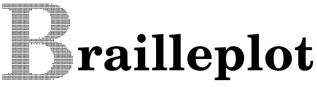
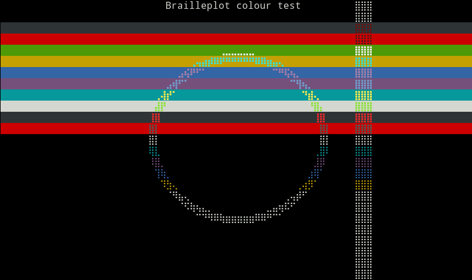
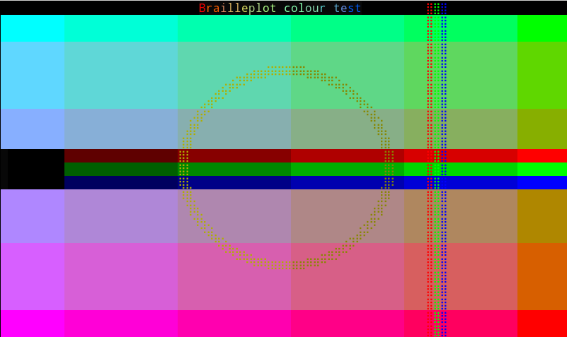
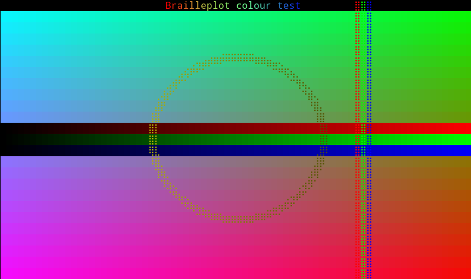

A simple colour graphics library for the Linux terminal using Braille dots as
pixels written in C.

## How it works

To use the brailleplot.h library, include it (`# include <brailleplot.h>`) and
create a brailleplot_canvas variable:

	brailleplot_canvas canvas; /* The canvas stores the activated pixels and colours */

Then initialize the canvas specifying its width and height in characters and the
colour mode (DEFAULT, C16, C256 or CTRUE).

	/* Initialise brailleplot */
	brailleplot_init(&canvas, WIDTH, HEIGHT, C16);

Draw on the canvas with brailleplot primitives for points, lines, circles, etc.
To draw the canvas on the screen, use

	/* Flush to screen */
	brailleplot_refresh(&canvas);

Once you have finished using brailleplot, free memory and clean up with

	/* Clean up */
	brailleplot_close(&canvas);

Check out the code in `colour_test_C16.c` for a relatively straightforward
example.

### Brailleplot primitives

The following is a list of brailleplot instructions.

* `brailleplot_cls(brailleplot_canvas * canvas)`: clear the canvas.
* `rgb_C256(int r, int g, int b)`: Returns the closest value to a true colour
RGB value in 256 colour mode. The integers r, g and b in the [0-255] range
indicate the intensity of red, green and blue.
* `rgb(int r, int g, int b)`: RGB integer from red, green and blue intensities.
* `brailleplot_setpixel(brailleplot_canvas * canvas, int x, int y, int c)`:
Activate (`c = 1`) or deactivate (`c = 0`) a pixel at coordinates `x` and `y`.
* `brailleplot_getpixel(brailleplot_canvas * canvas, int x, int y, int c)`:
Get the pixel value at coordinates `x` and `y`.
* `brailleplot_line(brailleplot_canvas * canvas, int x1, int y1, int x2, int y2, int c)`:
Draw a line from coordinates (`x1`, `y1`) to coordinates (`x2`, `y2`) by turning pixels
on (`c = 1`) or off (`c = 0`).
* `brailleplot_circle(brailleplot_canvas * canvas, int x, int y, int r, int c)`:
Draw a circle of radius `radius`centred at coordinates (`x`, y) by turning pixels on
(`c = 1`) or off (`c = 0`).
* `brailleplot_setchar(brailleplot_canvas * canvas, int i, int j, char c)`: Set the
character `c` at row `i` and column `j`.
* `brailleplot_setstring(brailleplot_canvas * canvas, int i, int j, char * str)`:
Write the string `str` at row `i` and column `j`.
* `brailleplot_setcolour(brailleplot_canvas * canvas, int row, int column, int background, int foreground)`:
Set the foreground and background colour of a character on the screen. Note that
brailleplot cannot set the colour of an individual pixel on the screen.
* `brailleplot_get(brailleplot_canvas * canvas, int x1, int y1, int x2, int y2, struct brailleplot_bitmap * bitmap)`:
Capture a bitmap from the screen in the box limited by the (`x1`, `y1`) and
(`x2`, `y2`) coordinates.
* `brailleplot_bitmap(brailleplot_canvas * canvas, int x0, int y0, struct brailleplot_bitmap bitmap)`:
Paste a bitmap onto the canvas at coordinates (`x0`, `y0`).
* `brailleplot_xorput(brailleplot_canvas * canvas, int x0, int y0, struct brailleplot_bitmap bitmap)`:
Superimpose a bitmap onto the canvas at coordinates (`x0`, `y0`).
* `brailleplot_getforeground(brailleplot_canvas * canvas, int row, int column)`
and `brailleplot_getbackground(brailleplot_canvas * canvas, int row, int column)`:
Get the foreground and background colours of a character in the text buffer.
* `kbhit()`: Capture key presses.

## Examples

Compiling the project with `make`creates two executables: `pam2braille` and
`bplot`.

### pam2braille

This program converts a portable anymap image file (pbm, pgm or ppm) into
black and white Braille art. For example, running

> `./pam2braille examples/B.pbm`

should produce the image of a large letter **B**:

### bplot

`bplot` is a very simple plotting program. It accepts ASCII data files (or
pipes) formatted by rows. Run `./bplot` for a usage message. There are five
types of rows:

1. A blank line represents the end of a frame.
2. A single integer representing an RGB colour
3. Two coordinates of a pixel.
4. Three values for the x and y coordiantes of the center and radius of a
   circle.
5. Four values for the coordinates of the ends of a segment.

For an example, run `./bplot examples/bplot_example.dat`.

## Testing your terminal's colour modes

Run `make test` to create three executable programs to test the three colour
modes available in `brailleplot.h`. If the colour modes work properly on your
terminal, you should get the following outputs.

### colour_test_C16

### colour_test_C256

### colour_test_CTRUE

